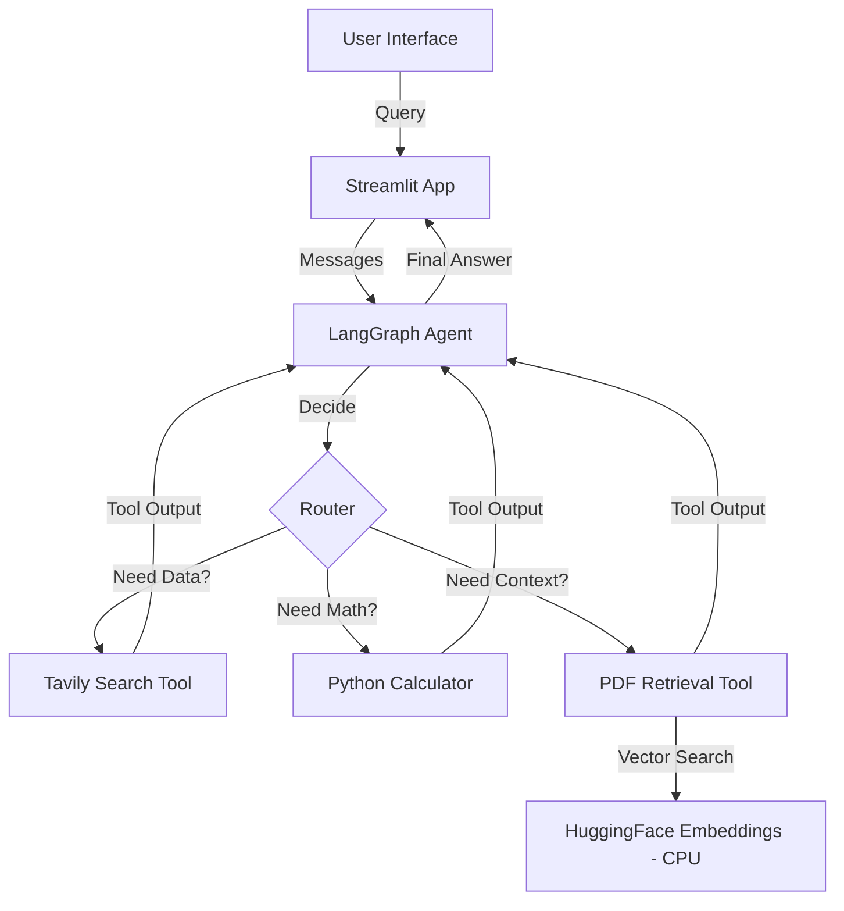

# Filin AI: Autonomous Finance Agent

> An intelligent, autonomous agent that acts as a dedicated financial analyst, capable of real-time market research, complex calculations, and deep document analysis using Llama 3.3 and LangGraph.


## 📖 Overview

This project is not just a chatbot, it is a **decision-making engine**. It bridges the gap between real-time web data and internal financial documents.

Users interact via a streaming interface (Streamlit), asking complex financial questions. The system uses Groq's Llama 3.3 to autonomously decide which tools to use—whether to search the web for live stock prices (Tavily), perform math (Calculator), or read through uploaded PDF reports (RAG) to extract specific risk factors or financial results.

## 🏗️ Architecture

The system follows a Graph-Based Agentic architecture:


## ⚡ Tech Stack
**Frontend & Interface**
- UI: Streamlit (Python-based web app)
- Visualization: Real-time thought process streaming

**AI & Orchestration**
- Orchestration: LangGraph (State-machine based agent loops)
- Framework: LangChain v1.0+
- LLM: Llama 3.3-70b-Versatile (via Groq API)
- Embeddings: HuggingFace all-MiniLM-L6-v2 (Optimized for CPU)

**Infrastructure**
- Containerization: Docker & Docker Compose
- Search: Tavily AI Search API
- Vector Store: In-memory Vector Search (FAISS/Chroma integration)

## 🚀 Features
- **Autonomous Tool Routing:** The agent intelligently selects between Web Search, Calculator, and Document Analysis without user intervention.
- **RAG (Retrieval Augmented Generation):** Upload financial PDFs (10-Ks, reports) and ask specific questions. The agent cites sources directly from the text.
- **Real-Time Streaming:** Watch the agent "think" in real-time as it calls tools, processes data, and formulates answers.
- **Strict Guardrails:** Custom system prompts ensure the agent stops searching once it finds the answer, preventing infinite loops.
- **Dockerized Environment:** The entire stack, including the embedding models, runs in an isolated container with volume mapping for easy file management.

## 🛠️ Getting Started
**Prerequisites**
- Python 3.9+
- Docker Desktop
- Groq API Key
- Tavily API Key

**1. Installation**
```sh
git clone https://github.com/your-username/finance-agent.git
cd finance-agent
```

**2. Environment Setup**
Create `.env` file in the root directory:
```ssh
GROQ_API_KEY=gsk_your_groq_key_here
TAVILY_API_KEY=tvly_your_tavily_key_here
```

**3. Start the Application:** We use Docker Compose to handle dependencies and the build process automatically.
```ssh
# Build and run in detached mode
docker-compose up --build -d

# View logs to ensure the agent is ready
docker-compose logs -f
```
_Access the agent at http://localhost:8501_

**4. Adding Data:** To use the RAG feature, place your PDF documents (e.g., nvidia_10k.pdf) into the ./data folder on your host machine. The Docker volume will map this automatically to the agent.

## 🔮 Roadmap
- [x] Phase 1: Core Agent Logic (LangGraph + Llama 3)
- [x] Phase 2: Tool Integration (Search, Calculator, RAG)
- [x] Phase 3: Docker Containerization & Volume Mapping
- [x] Phase 4: Real-time Streaming UI
- [ ] Phase 5: Persistent Database (Postgres/Supabase) for chat history
- [ ] Phase 6: Financial Charting (Plotly integration)

## 🤝 Contributing
1. Fork the Project
2. Create your Feature Branch (`git checkout -b feat/NewTool`)
3. Commit your Changes (`git commit -m 'feat: Add Stock Chart Tool'`)
4. Push to the Branch (`git push origin feat/NewTool`)
5. Open a Pull Request
